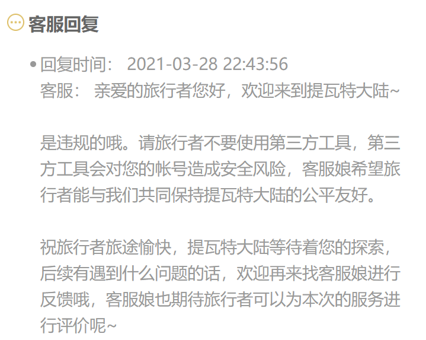

<h1 align="center">Genshin-lyre-auto-play</h1>

简体中文| [English](./README_en.md)

## 简介
根据midi文件演奏“风物之诗琴”的脚本。由Python驱动,在此承诺，⚠️项目内绝不含任何能够引起安全问题的代码。



前排提示：所有键盘在动但是原神没反应的都是因为没有管理员权限，双击`run.bat`或者以管理员模式运行命令行可以解决问题！(适用于方法二运行)


## 使用方法

### 方法一

对于没有接触过相关内容的用户，可以使用打包的exe文件：[下载链接](https://github.com/Misaka17032/genshin-lyre-auto-play/releases/)

双击运行然后按照提示输入midi文件名（不包含后缀，即`.mid`）

ico图标来源于网络,侵删


### 方法二

<details>
<summary>查看</summary>

### 运行环境

```
Windows
python 3.x
pywin32 （用于模拟键盘输入）
numpy
```

### 1. 安装Python

去Python官网下载然后安装

### 2.安装模块

安装并配置好python环境后使用`pip install -r requirements.txt`命令安装模块。

国内可以使用：

```
pip install -i https://pypi.tuna.tsinghua.edu.cn/simple -r requirements.txt
```

### 3.运行

使用管理员权限运行`python piano.py`

</details>

## 注意

任何双击bat文件一闪而过都是因为程序出错，请按以下步奏依次检查：

1. 检查是否安装了python 3.x并且设置了Path；
2. 检查是否安装好了依赖包；
3. 检查输入参数是否有误；
4. 发一个issue，附上详细情况。


~~在输入midi名称后程序会自己切换回游戏内并演奏，如需退出可以最小化游戏窗口或者关闭程序窗口~~

新版本可自行选择↑

## 如何使用自己的曲谱？

确保乐谱midi文件中的音符在中央C和上下两个八度的白键位  并将midi文件放入名为`songs`的文件夹里。


## 声明

转载请务必加上来源，谢谢。请不要使用项目本体或者项目内曲谱进行任何盈利行为。

多人联携模式正在开发中。

**可以给一个star嘛，秋梨膏~♥**
